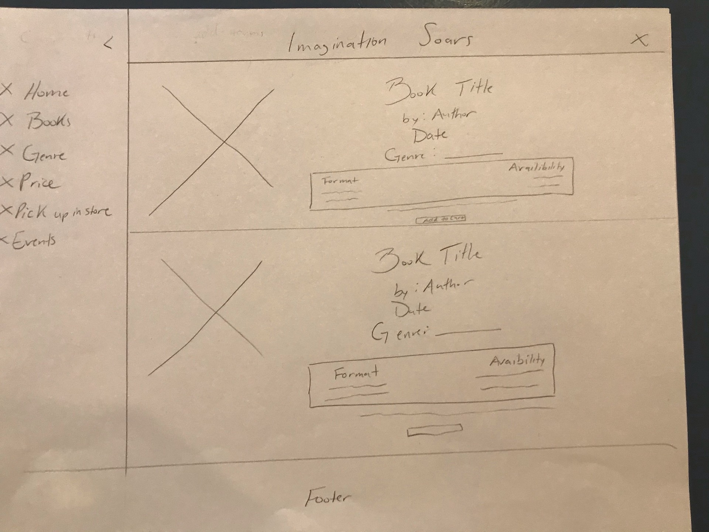
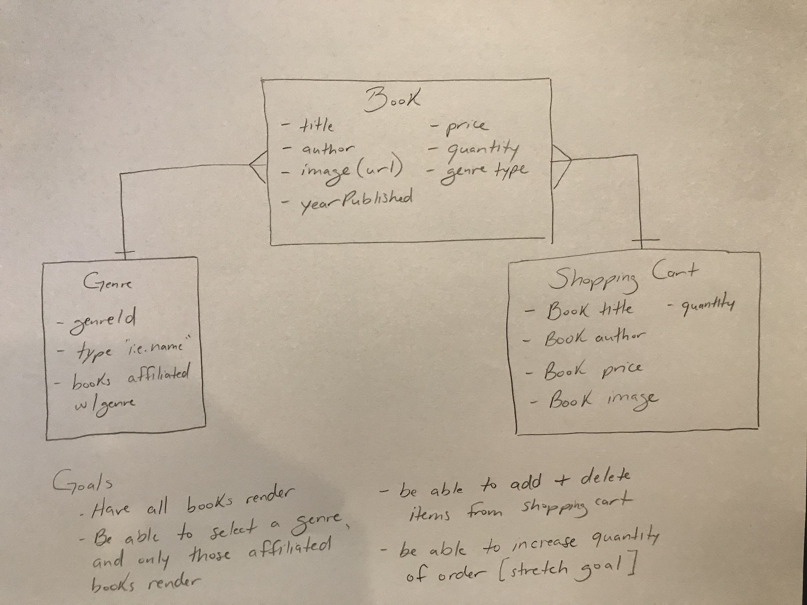

# eCommerce Title....

#### Project description and backstory....

##### Important Links:
[**Deployed Site**](https://tranquil-hollows-36268.herokuapp.com/)

[GitHub Link](https://github.com/brittmagee/SEI23-Project3)

[Project board](https://github.com/brittmagee/SEI23-Project3/projects/1)

<dl>
  <dt>Tech Specs</dt>
    <dd>React</dd>
    <dd>JavaScript</dd>
    <dd>Node.js</dd>
    <dd>Express.js</dd>
    <dd>MongoDB.js</dd>
    <dd>Mongoose</dd>
    <dd>HTML5</dd>
    <dd>CSS</dd>
</dl>

#### This application has: 

* Three API models – ....
* CSS styling...
* Wireframes that were designed during the planning process.
* ERD
* Deployed online and accessible to the public via Heroku

### Wireframe & ERD Images

